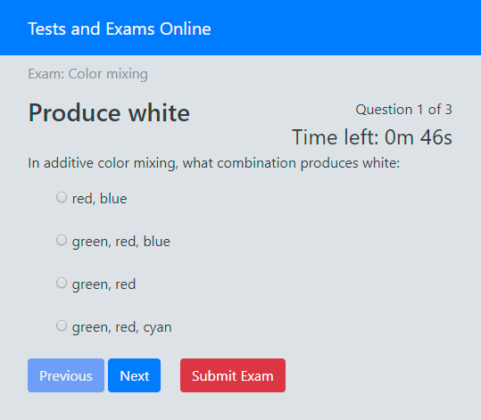

# TestExamMaker

## Introduction
This is a case study project for a series of articles I'm writing about developing webapps based on [Redux](http://redux.js.org/). It is not finished yet, nor the articles. It is based on my recent blog article "[Web app architecture based on Redux](http://devblog.ztp.pt/web-app-architecture-based-on-redux/)" (also on [Medium](https://medium.com/p/web-app-architecture-based-on-redux-1e16294c817a)).

## Project Subject
The project is a webapp for making online exams or quizzes:
- Read the exam data from a server
- Allow single and multi-option answers, no open/text answers
- Time the examination using a server side timer
- Allow the user to finish the exam earlier
- Evaluate answers at the end and give result
- Mock the server on the client side, including exam data.

## Solution
The project uses the following technologies:
- Angular 4
- AngularCLI, AoT and Lazyloading
- RxJS used extensively
- @ngrx/store (Redux implementation)
- @ngrx/effects (side effects) for main business logic
- Bootstrap 4 for base web design and components
- Karma/Jasmine unit tests
- Protractor end-to-end tests

Also uses two small packages (also mine):
- [router-store-ser](https://github.com/akaztp/router-store-ser): An (sort of) extension to @ngrx/router-store providing router serialization and a navigation action. This allows for ReduxDevTools time travel to work.
- [match-observables](https://github.com/akaztp/match-observable): A simple function to implement a comparison between an observable and an array of values.

The project uses a [customized AirBnb Style Guide](./style-guide-ts.md). My "AirBnb Style Guide" adoption is recent, so this project is surely not fully compliant (besides the customization). Only what is enforced by TSLint is fully compliant.

Linting is enabled and rules are modularized.

## RoadMap
- Business models. **Done**.
- Plan redux state. **Done**.
- Plan redux actions and reducers. **Done**.
- Plan redux effects. **Done**.
- Init Angular CLI app. **Done**.
- Exam Angular module, routing, lazy loading. **Done**.
- Redux state. **Done**.
- Redux actions. **Done**.
- Redux reducers. **Done**.
- Redux effects and data services. **Done**.
- Containers, components, styling. **Done**.
- General Review. **In progress**.

## Development server
Run `npm run serve` for a dev server. Navigate to `http://localhost:4200/`. The app will automatically reload if you change any of the source files.

## Build
Run `npm run build` to build the project. The build artifacts will be stored in the `dist/` directory. Use the `-prod` flag for a production build.

## Lint
Run `npm run lint` to lint the project. Read more about the configuration for [customized AirBnb Style Guide](./style-guide-ts.md)

## Running unit tests
Run `npm run test` to execute the unit tests via [Karma](https://karma-runner.github.io).

## Running end-to-end tests
Run `npm run e2e` to execute the end-to-end tests via [Protractor](http://www.protractortest.org/).
Before running the tests make sure you are serving the app via `npm run serve`.
